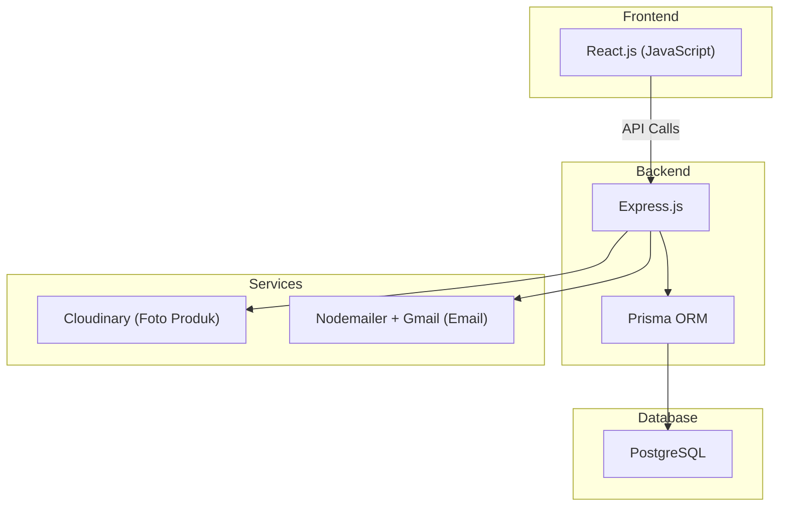

# 🍪 Utique — Rangkuman Brainstorming

> **Utique** — diambil dari nama **Utik** (nama ibu) + **Que** (kue).
> Toko cookies online berbasis pre-order untuk lingkungan dan orang-orang terdekat.

---

## 1. Gambaran Umum

| Aspek | Detail |
|---|---|
| **Nama** | Utique |
| **Jenis Produk** | Cookies |
| **Model Bisnis** | Pre-order (bukan ready stock) |
| **Target Pasar** | Lingkungan & orang-orang terdekat |
| **Kapasitas Produksi** | Maks. 10 order per hari |
| **Platform** | Web Application (responsive) |

---

## 2. Fitur yang Direncanakan

### 🛍️ Customer Side

| Fitur | Deskripsi |
|---|---|
| **Registrasi & Login** | User mendaftar dan login untuk bisa memesan |
| **Manajemen Alamat** | User menambahkan dan mengelola alamat pengiriman |
| **Katalog Produk** | Menampilkan daftar cookies yang tersedia |
| **Detail Produk** | Menampilkan detail cookies dengan pilihan varian (rasa & ukuran) |
| **Keranjang (Cart)** | User bisa menambahkan cookies ke keranjang sebelum checkout |
| **Checkout** | Proses pemesanan dengan pemilihan alamat |
| **Pembayaran** | Transfer manual ke rekening toko + upload bukti bayar |
| **Batas Waktu Bayar** | Sistem otomatis membatalkan order jika tidak bayar dalam waktu tertentu (misal 1x24 jam) |
| **Estimasi Pembuatan** | Muncul setelah pembayaran dikonfirmasi admin |
| **Tracking Pengiriman** | Nomor resi + link ke website ekspedisi untuk cek status pengiriman |
| **Riwayat Pesanan** | Melihat semua pesanan beserta statusnya |
| **Review** | Customer bisa memberikan review/rating setelah pesanan selesai |
| **Notifikasi** | Notifikasi update status pesanan via dashboard & email |

### 🔧 Admin Side

| Fitur | Deskripsi |
|---|---|
| **Dashboard** | Ringkasan order hari ini dan overview umum |
| **Manajemen Produk** | CRUD produk cookies (nama, deskripsi, foto, varian, harga) |
| **Upload Foto Produk** | Upload foto cookies via dashboard admin |
| **Manajemen Order** | Melihat daftar order masuk |
| **Konfirmasi Pembayaran** | Memverifikasi bukti bayar dari customer |
| **Update Status Pesanan** | Mengubah status order sesuai progress |
| **Set Estimasi** | Override estimasi pembuatan jika diperlukan |
| **Input Resi** | Memasukkan nomor resi pengiriman |
| **Notifikasi Order Masuk** | Notifikasi via email ketika ada order baru |
| **Statistik** *(Fase 2)* | Produk terlaris, total revenue, trend penjualan |

---

## 3. Alur Pengguna (User Flow)

### Customer Flow
```
Register → Login → Browse Katalog → Pilih Produk → Pilih Varian (Rasa & Ukuran)
→ Add to Cart → Checkout (pilih alamat) → Bayar (transfer + upload bukti)
→ Menunggu Konfirmasi Admin → Pembayaran Dikonfirmasi
→ Lihat Estimasi Pembuatan → Pesanan Diproses → Dikirim (dapat resi)
→ Pesanan Diterima → Beri Review ⭐
```

### Admin Flow
```
Login → Lihat Dashboard → Ada Order Masuk (notifikasi email)
→ Cek Bukti Bayar → Konfirmasi Pembayaran → Order Masuk Antrian Produksi
→ Proses Pembuatan → Selesai → Kirim via Ekspedisi → Input Resi
→ Selesai
```

---

## 4. Status Pesanan

Alur status pesanan dari awal hingga selesai:

```
Menunggu Pembayaran → Pembayaran Diterima → Dalam Antrian
→ Sedang Dibuat → Selesai Dibuat → Dikirim → Selesai
```

> [!NOTE]
> Jika customer tidak membayar dalam batas waktu yang ditentukan, status otomatis berubah menjadi **Dibatalkan**.

---

## 5. Sistem Pre-Order & Estimasi

### Mekanisme: Semi-Otomatis

- Setiap produk memiliki **waktu produksi default** (misal: 2 hari kerja)
- Sistem menghitung estimasi berdasarkan:
  - **Tanggal pembayaran dikonfirmasi**
  - **Waktu produksi default**
  - **Jumlah antrian yang ada** (maks. 10 order/hari)
- Admin bisa **override estimasi** secara manual jika diperlukan

### Contoh Perhitungan

```
Kapasitas: 10 order/hari
Waktu produksi cookies: 2 hari kerja

Senin: 10 slot → penuh
Selasa: 8 slot terisi

Order baru dibayar Senin malam
→ Masuk antrian Selasa (slot ke-9)
→ Estimasi selesai: Selasa + 2 hari = Kamis
```

---

## 6. Varian & Harga Produk

### Struktur Varian
- Setiap cookies bisa memiliki **beberapa rasa** dan **beberapa ukuran**
- **Semua kombinasi rasa × ukuran tersedia** (tergantung kemampuan produksi)
- **Harga berbeda** per kombinasi varian dan ukuran

### Contoh Struktur

| Produk | Rasa | Ukuran | Harga |
|---|---|---|---|
| Cookies Classic | Choco Chip | Small (10pcs) | Rp 25.000 |
| Cookies Classic | Choco Chip | Medium (20pcs) | Rp 45.000 |
| Cookies Classic | Red Velvet | Small (10pcs) | Rp 30.000 |
| Cookies Classic | Red Velvet | Medium (20pcs) | Rp 55.000 |

> [!NOTE]
> Untuk saat ini belum ada fitur **custom request** (tulisan khusus, dekorasi, dll) dan belum ada **seasonal/limited edition**.

---

## 7. Pembayaran

| Aspek | Detail |
|---|---|
| **Metode** | Transfer bank manual (BCA/BNI/dll) |
| **Konfirmasi** | Customer upload bukti bayar, admin verifikasi manual |
| **Batas Waktu** | Order otomatis dibatalkan jika tidak bayar dalam waktu tertentu |
| **Fase Lanjutan** | Integrasi payment gateway (Midtrans/Xendit) jika dibutuhkan |

---

## 8. Pengiriman

| Aspek | Detail |
|---|---|
| **Metode** | Jasa ekspedisi (JNE, J&T, SiCepat, dll) |
| **Ongkir** | Manual / flat rate per zona untuk awal |
| **Tracking** | Admin input nomor resi manual → customer dapat link tracking ke website ekspedisi |
| **Fase Lanjutan** | Integrasi API ongkir (RajaOngkir) jika dibutuhkan |

---

## 9. Notifikasi

| Target | Channel | Trigger |
|---|---|---|
| **Admin** | Email (Nodemailer + Gmail SMTP) | Order baru masuk |
| **Customer** | Dashboard + Email | Perubahan status pesanan (pembayaran dikonfirmasi, sedang diproses, dikirim + resi, selesai) |

> [!TIP]
> Gmail SMTP gratis dengan limit 500 email/hari — lebih dari cukup untuk skala awal.

---

## 10. Tech Stack

### Arsitektur



| Layer | Teknologi |
|---|---|
| **Frontend** | React.js (JavaScript) — 1 app untuk customer & admin |
| **Backend** | Express.js |
| **ORM** | Prisma |
| **Database** | PostgreSQL |
| **File Storage** | Cloudinary (free tier: 25GB) |
| **Email** | Nodemailer + Gmail SMTP |
| **Auth** | Role-based (Customer & Admin) |

### Hosting (Free Tier)

| Service | Fungsi |
|---|---|
| **Vercel** | Deploy frontend React |
| **Railway** atau **Render** | Deploy backend Express |
| **Neon** atau **Supabase** | PostgreSQL database |
| **Cloudinary** | Upload & serve foto produk |

---

## 11. Struktur Halaman

### Customer Pages

| Halaman | Route (Draft) | Deskripsi |
|---|---|---|
| Home / Landing | `/` | Halaman utama, highlight produk |
| Katalog | `/products` | Daftar semua cookies |
| Detail Produk | `/products/:id` | Detail cookies + pilih varian + add to cart |
| Keranjang | `/cart` | Daftar item di keranjang |
| Checkout | `/checkout` | Isi alamat, review pesanan |
| Pembayaran | `/payment/:orderId` | Info rekening + upload bukti bayar |
| Riwayat Pesanan | `/orders` | Daftar semua pesanan user |
| Detail Pesanan | `/orders/:id` | Status, estimasi, resi, link tracking |
| Profil | `/profile` | Edit profil & kelola alamat |
| Login | `/login` | Halaman login |
| Register | `/register` | Halaman registrasi |

### Admin Pages

| Halaman | Route (Draft) | Deskripsi |
|---|---|---|
| Dashboard | `/admin` | Overview order & ringkasan |
| Manajemen Produk | `/admin/products` | CRUD produk cookies |
| Tambah/Edit Produk | `/admin/products/new` atau `/admin/products/:id/edit` | Form produk + upload foto |
| Manajemen Order | `/admin/orders` | Daftar semua order |
| Detail Order | `/admin/orders/:id` | Konfirmasi bayar, update status, input resi |

---

## 12. Roadmap Pengembangan

### 🚀 Fase 1 — MVP (Minimum Viable Product)

> Fokus: Fitur inti agar toko bisa beroperasi.

- [ ] Setup project (React + Express + Prisma + PostgreSQL)
- [ ] Desain database schema
- [ ] Auth system (register, login, role-based)
- [ ] CRUD produk + upload foto (admin)
- [ ] Katalog & detail produk (customer)
- [ ] Keranjang & checkout
- [ ] Pembayaran (transfer manual + upload bukti + batas waktu)
- [ ] Manajemen order (admin: konfirmasi bayar, update status)
- [ ] Estimasi pembuatan (semi-otomatis + override)
- [ ] Input resi & link tracking
- [ ] Notifikasi email (order masuk untuk admin, status update untuk customer)
- [ ] Deploy ke hosting gratis

### 🌟 Fase 2 — Enhancement

> Fokus: Fitur tambahan untuk meningkatkan pengalaman.

- [ ] Review & rating dari customer
- [ ] Statistik penjualan (produk terlaris, revenue, trend)
- [ ] Integrasi API ongkir (RajaOngkir)
- [ ] Kode promo / diskon *(opsional)*
- [ ] Integrasi payment gateway *(opsional)*
- [ ] WhatsApp notification *(opsional, jika ada API gratis)*

---

> [!IMPORTANT]
> Dokumen ini adalah hasil brainstorming awal. Detail teknis seperti **database schema**, **API design**, dan **UI/UX mockup** akan dirancang pada tahap implementasi.
